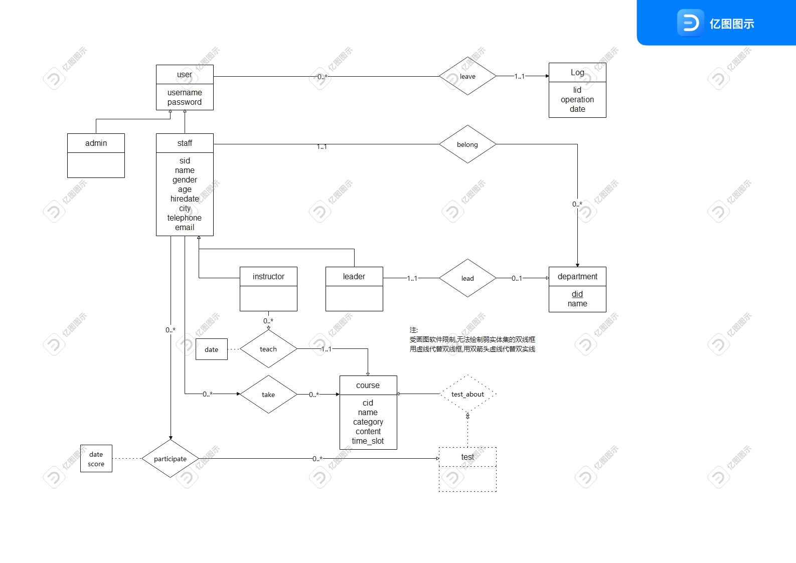

# 数据库设计PJ

员工培训管理系统

[学号] 赵书誉

19302010020 袁逸聪

## E-R模型设计



## E-R图转换为关系模式

### 实体集

- 部门信息 department (<u>dept_id</u>, name)

- 课程信息 course (<u>course_id</u>, name, category, content, start_time, end_time)

- 用户信息 user(<u>username</u>, password)

- 管理员 admin(<u>username</u>)

- 职员信息 staff (<u>user_id</u>, username, name, gender, age, hire_date, city, telephone, email)

- 教师信息 instructor(<u>user_id</u>, office_date)

- 主管信息 leader(<u>user_id</u>, office_date)

- 日志信息 log (<u>log_id</u>, operation, date)

  

### 关系集

- 职员 & 部门：属于 belong (<u>user_id</u>, <u>dept_id</u>)
- 普通员工 & 课程：培训 take (<u>user_id</u>, <u>course_id</u>, evaluation)
- 普通员工 & 课程：考试 participate (<u>user_id</u>, <u>course_id</u>, <u>time</u>, score)
- 教师 & 开课：教授 teach (<u>user_id</u>, <u>course_id</u>)
- 主管 & 部门：主管 charge(<u>user_id</u>, <u>dept_id</u>)
- 部门 & 课程：要求 offer(<u>dept_id</u>, <u>course_id</u>, require)
- 用户 & 日志：痕迹 trace (<u>user_id</u>, <u>log_id</u>)


### 关系模式对应建表sql

+ department：存储和管理部门信息的数据库表，主键是部门编号dept_id。

```sql
CREATE TABLE department (
  dept_id INT NOT NULL AUTO_INCREMENT,
  name VARCHAR(20) NOT NULL UNIQUE,
  PRIMARY KEY (dept_id)
);
```

+ course：用于存储和管理课程信息的数据库表，主键是课程编号course_id。

```sql
CREATE TABLE course (
  course_id CHAR(5) NOT NULL,
  name VARCHAR(20) NOT NULL,
  content VARCHAR(255) NOT NULL,
  category VARCHAR(20) NOT NULL,
  start_time DATE NOT NULL,
  end_time DATE NOT NULL,
  PRIMARY KEY (course_id)
);
```

- user：存储和管理用户账号的数据库表，主键是用户名 username。

```sqlite
CREATE TABLE user (
  username VARCHAR(20) NOT NULL,
  password VARCHAR(40) NOT NULL,
  PRIMARY KEY (username)
);
```

- admin：管理员信息

```sql
CREATE TABLE admin (
  username VARCHAR(20) NOT NULL,
  PRIMARY KEY (username),
  FOREIGN KEY (username) REFERENCES user (username) ON DELETE CASCADE ON UPDATE CASCADE
);
```

- employee：雇员信息

```sql
CREATE TABLE employee (
  user_id CHAR(11) NOT NULL,
  username VARCHAR(20) NOT NULL,
  name VARCHAR(20) NOT NULL,
  gender VARCHAR(10) NOT NULL CHECK (gender IN ("男", "女")),
  age INTEGER NOT NULL,
  hiredate DATE NOT NULL,
  city VARCHAR(255) NOT NULL,
  telephone CHAR(11) NOT NULL,
  email VARCHAR(255) NOT NULL,
  PRIMARY KEY (user_id),
  FOREIGN KEY (username) REFERENCES user (username) ON DELETE CASCADE ON UPDATE CASCADE
);
```

- staff：普通职员

```sql
CREATE TABLE staff (
  user_id CHAR(11) NOT NULL,
  FOREIGN KEY (user_id) REFERENCES employee (user_id) ON DELETE CASCADE ON UPDATE CASCADE,
  PRIMARY KEY (user_id)
);
```

- instructor：教师

```sql
CREATE TABLE instructor (
  user_id CHAR(11) NOT NULL,
  office_date DATE NOT NULL, 
  FOREIGN KEY (user_id) REFERENCES employee (user_id) ON DELETE CASCADE ON UPDATE CASCADE,
  PRIMARY KEY (user_id)
);
```

- leader：领导

```sql
CREATE TABLE leader (
  user_id CHAR(11) NOT NULL,
  office_date DATE NOT NULL, 
  FOREIGN KEY (user_id) REFERENCES employee (user_id) ON DELETE CASCADE ON UPDATE CASCADE,
  PRIMARY KEY (user_id)
);
```

- log：存储与管理日志信息的数据库表，主键为log_id。

```sql
CREATE TABLE log (
  log_id INT NOT NULL AUTO_INCREMENT,
  operation VARCHAR(255) NOT NULL,
  date DATE NOT NULL,
  PRIMARY KEY (log_id)
);
```

- belong：员工属于哪个部门

```sql
CREATE TABLE belong (
  user_id CHAR(11) NOT NULL UNIQUE,
  dept_id INT NOT NULL,
  PRIMARY KEY (user_id, dept_id),
  FOREIGN KEY (user_id) REFERENCES employee (user_id) ON DELETE CASCADE ON UPDATE CASCADE,
  FOREIGN KEY (dept_id) REFERENCES department (dept_id) ON DELETE CASCADE ON UPDATE CASCADE
);
```

- take：普通员工选了哪个课

```sql
CREATE TABLE take (
  user_id CHAR(11) NOT NULL,
  course_id CHAR(5) NOT NULL,
  evaluation VARCHAR(20),
  PRIMARY KEY (user_id, course_id),
  FOREIGN KEY (user_id) REFERENCES staff (user_id) ON DELETE CASCADE ON UPDATE CASCADE,
  FOREIGN KEY (course_id) REFERENCES course (course_id) ON DELETE CASCADE ON UPDATE CASCADE
);
```

- participate

```sql
CREATE TABLE participate (
  user_id CHAR(11) NOT NULL,
  course_id CHAR(5) NOT NULL,
  time TIMESTAMP NOT NULL,
  score INT NOT NULL CHECK(score >= 0 AND score <= 100),
  PRIMARY KEY (user_id, course_id, time),
  FOREIGN KEY (user_id) REFERENCES staff (user_id) ON DELETE CASCADE ON UPDATE CASCADE,
  FOREIGN KEY (course_id) REFERENCES course (course_id) ON DELETE CASCADE ON UPDATE CASCADE
);
```

- teach：

```sql
CREATE TABLE teach (
  user_id CHAR(11) NOT NULL,
  course_id CHAR(5) NOT NULL UNIQUE,
  PRIMARY KEY (user_id, course_id),
  FOREIGN KEY (user_id) REFERENCES instructor (user_id) ON DELETE CASCADE ON UPDATE CASCADE,
  FOREIGN KEY (course_id) REFERENCES course (course_id) ON DELETE CASCADE ON UPDATE CASCADE
);
```

- charge：部门主管信息

```sql
CREATE TABLE charge (
  user_id CHAR(11) NOT NULL UNIQUE,
  dept_id INT NOT NULL UNIQUE,
  PRIMARY KEY (user_id, dept_id),
  FOREIGN KEY (user_id) REFERENCES leader (user_id) ON DELETE CASCADE ON UPDATE CASCADE,
  FOREIGN KEY (dept_id) REFERENCES department (dept_id) ON DELETE CASCADE ON UPDATE CASCADE
);
```

- trace：用户操作后留下的日志

```sql
CREATE TABLE trace (
  username VARCHAR(20) NOT NULL,
  log_id INT NOT NULL UNIQUE,
  PRIMARY KEY (username, log_id),
  FOREIGN KEY (username) REFERENCES user (username) ON DELETE CASCADE ON UPDATE CASCADE,
  FOREIGN KEY (log_id) REFERENCES log (log_id) ON DELETE CASCADE ON UPDATE CASCADE
);
```

- offer：部门下设的课程
11441
```sql
CREATE TABLE offer (
  dept_id INT NOT NULL,
  course_id CHAR(5) NOT NULL,
  require VARCHAR(10) NOT NULL CHECK (require IN ("必修", "选修")),
  PRIMARY KEY (dept_id, course_id),
  FOREIGN KEY (dept_id) REFERENCES department (dept_id) ON DELETE CASCADE ON UPDATE CASCADE,
  FOREIGN KEY (course_id) REFERENCES course (course_id) ON DELETE CASCADE ON UPDATE CASCADE
);
```


## 函数依赖与范式分析


## 约束条件分析与实现


## 使用指南


### Django


### API说明
