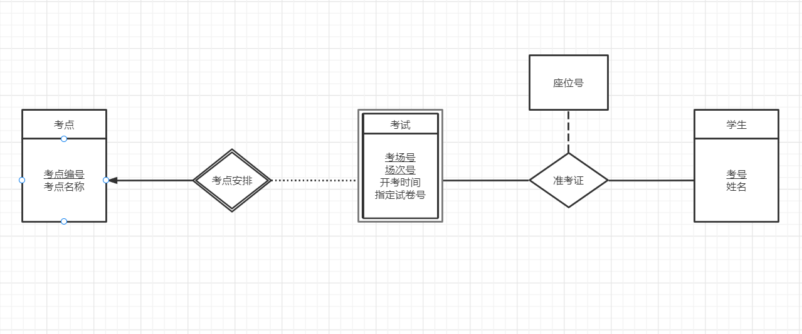

# DataBaseDesign

19302010020 袁逸聪

Lab使用mysql与python3.9

- mysql  Ver 14.14 Distrib 5.7.33, for Win64 (x86_64)

## 表模型分析

为了尽可能降低数据库的耦合性，提高复用空间，应先考虑所提供的数据中有哪些可抽象的实体概念，而不是完全根据数据内容创建表。

1. 考点：考点应是独立的实体，具有考点号、考点名称两个字段
2. 学生：学生应是独立的实体，具有姓名字段（考虑到重名可能，应当添加学号）
3. 考试：在某个考场举行的考试，引用考点的考点号、考点名称字段，本身具有考场号、场次号、开考时间、指定试卷号
4. 准考证：某学生参与某场考试，引用考试的考点号、考场号、场次号（间接地引用了考点）字段，引用学生的姓名字段，本身具有考号、指定座位号

从引用关系的角度分析，考试基于考点，准考证基于考试和学生

从实体-关系的角度分析，则还需要补充：

1. 考点、考试、学生为实体，准考证表示的学生与考试之间的参与关系，用联系集表示
2. 考点和考试之间也存在“安排于”的关系，应当设置联系集
3. 考试实体集是一个弱实体集，因为去除了冗余的考点编号属性后，其余属性不足以表示元组了

- 使用的画图工具Process On无法绘制双线，顾使用点线代替弱实体集与弱联系集的连接符

## 关系模式

注：命名沿用了数据表中英文与拼音混合的方式

实体集

- kd(<u>kdno</u>,kd_name)
- exam(<u>kdno</u>,<u>kcno</u>,<u>ccno</u>,exptime,papername)
- student(<u>stu_no</u>,stu_name)

联系集
- exam_takes(<u>registno</u>,seat,stu_no,kdno,kcno,ccno)
- exam_arrangement(<u>kdno</u>,<u>kcno</u>,<u>ccno</u>,exptime,papername)

对于弱实体集exam，其对应的弱联系集关系模式与其自身完全一致。此处处理方式参考书本P182与P183对于section与sec_course的分析。

但我认为此时的弱联系集（exam_arrangement、sec_course）是实现上的冗余，故在Lab实现中省略。

## 字段类型

| 字段名称  | 字段类型      |
| --------- | ------------- |
| kdno      | numeric(4,0)  |
| kd_name   | varchar(20)   |
| kcno      | numeric(4,0)  |
| ccno      | numeric(4,0)  |
| exptime   |               |
| papername | varchar(20)   |
| stu_no    | numeric(11,0) |
| stu_name  | varchar(20)   |
| registno  | numeric(6,0)  |
| seat      | numeric(3,0)  |
